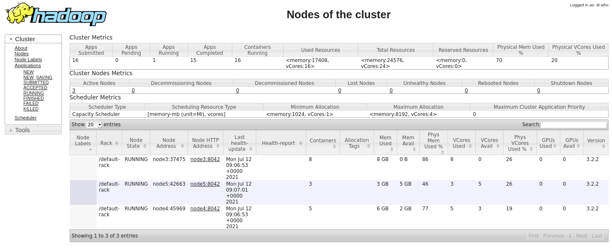
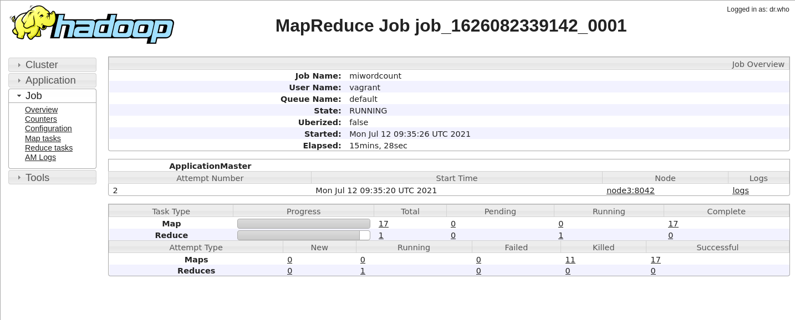

# Table of Contents

1.  [Build a test Hadoop cluster (Hadoop 3.2.2; Spark 3.1.2; Pig 0.17.0; Hive 3.1.2) using Vagrant](#org48316f5)
    1.  [Introduction](#orga94bc9f)
    2.  [Building-up the cluster](#orgacc9318)
    3.  [Testing the state of the cluster](#orgadfe6d0)
        1.  [HDFS (node 1, port 9870)](#org343738d)
        2.  [YARN (node 2, port 8088)](#orgcf2d5e5)
        3.  [Job History (node 2, port 19888)](#orga6e6822)
        4.  [Spark (node 1, port 8080)](#org14c5104)
    4.  [Running jobs in the cluster](#org0b36e4d)
        1.  [MapReduce jobs](#org8b908ae)
        2.  [Pig](#org8e5e1d7)
        3.  [Hive](#org5de8572)
        4.  [Spark](#org90d4b1d)

# Build a test Hadoop cluster (Hadoop 3.2.2; Spark 3.1.2; Pig 0.17.0; Hive 3.1.2) using Vagrant

**NOTE: This is just a test *work-in-progress* repository. Things might be broken and/or poorly documented. If you find anything wrong with the scripts and/or instructions, please let me know so I can fix it in future commits**

## Introduction

The idea of this project is to quickly create a Hadoop cluster to learn and
experiment with Hadoop, Spark, etc.

The project uses Vagrant to provision the machines making up the cluster, and at
present we target VirtualBox, so by default we create five virtual machines
(Ubuntu Bionic 18.04) with VirtualBox, with the following software versions:
Hadoop 3.2.2; Spark 3.1.2; Pig 0.17.0; Hive 3.1.2.  

The configuration of the default cluster is as follows:

1.  node1 (IP: 10.211.55.101): HDFS NameNode + Spark Master
2.  node2 (IP: 10.211.55.102): YARN ResourceManager + JobHistoryServer + ProxyServer
3.  node3 (IP: 10.211.55.103): HDFS DataNode + YARN NodeManager + Spark Slave
4.  node4 (IP: 10.211.55.104): HDFS DataNode + YARN NodeManager + Spark slave
5.  node5 (IP: 10.211.55.105): HDFS DataNode + YARN NodeManager + Spark Slave

All nodes are configure to have 2GB of RAM. node1 and node2 should always be
there, but you can have as many worker nodes as you want. By default, we create
3 worker nodes (for a total of 5 nodes), but you can change the total number of
nodes by changing the line *numNodes = 5* in the *Vagrantfile* file.

If the above IP address range causes problems in your network, it can easily be
changed in the *Vagrantfile* file.

To get the cluster up-and-running, you will need to have VirtualBox
(<https://www.virtualbox.org/>) and Vagrant (<https://www.vagrantup.com/>), and
about 10GB of RAM (assuming you spin 5 virtual machines). 
*This was tested with Virtualbox 6.1.22-2, and Vagrant 2.2.16, though it should work with older versions as well. Let me know if you try it).*

**NOTE**: This project is a variation on the
 <https://github.com/njvijay/vagrant-jilla-hadoop> repository, with slightly
 different roles for the nodes, and using a different version of the machines'
 OSs, as well as up-to-date versions of Hadoop, Spark, etc.

## Building-up the cluster

To create the cluster, you simply do:

    vagrant-hadoop$ vagrant up

The first time you run it, the software packages will be downloaded and copied
to the directory *resources*. If you destroy and build the cluster again at a
later stage, these downloaded files will be used instead, so building the
cluster should be much faster.

The mirrors used to download the software packages can be changed by editing the
file *scripts/common.sh*

If all went well, the cluster will be ready in 10-15 minutes after provisioning
the five virtual machines, with a long output like:

    vagrant-hadoop$ vagrant up
    Bringing machine 'node5' up with 'virtualbox' provider...
    Bringing machine 'node4' up with 'virtualbox' provider...
    Bringing machine 'node3' up with 'virtualbox' provider...
    Bringing machine 'node2' up with 'virtualbox' provider...
    Bringing machine 'node1' up with 'virtualbox' provider...
    ==> node5: Importing base box 'hashicorp/bionic64'...
    ==> node5: Matching MAC address for NAT networking...
    ==> node5: Checking if box 'hashicorp/bionic64' version '1.0.282' is up to date...
    ==> node5: Setting the name of the VM: node5
    ==> node5: Clearing any previously set network interfaces...
    ==> node5: Preparing network interfaces based on configuration...
        node5: Adapter 1: nat
        node5: Adapter 2: hostonly
    ==> node5: Forwarding ports...
        node5: 22 (guest) => 2222 (host) (adapter 1)
    ==> node5: Running 'pre-boot' VM customizations...
    ==> node5: Booting VM...
    
    
    [...]
    
    
       node1: WARNING: /usr/local/hadoop/logs does not exist. Creating.
        node1: node3: Warning: Permanently added 'node3,10.211.55.103' (ECDSA) to the list of known hosts.
        node1: node4: Warning: Permanently added 'node4,10.211.55.104' (ECDSA) to the list of known hosts.
        node1: node5: Warning: Permanently added 'node5,10.211.55.105' (ECDSA) to the list of known hosts.
        node1: ############## Starting Spark in the cluster
        node1: starting org.apache.spark.deploy.master.Master, logging to /usr/local/spark/logs/spark-root-org.apache.spark.deploy.master.Master-1-node1.out
        node1: node3: Warning: Permanently added 'node3,10.211.55.103' (ECDSA) to the list of known hosts.
        node1: node3: starting org.apache.spark.deploy.worker.Worker, logging to /usr/local/spark/logs/spark-root-org.apache.spark.deploy.worker.Worker-1-node3.out
        node1: node4: Warning: Permanently added 'node4,10.211.55.104' (ECDSA) to the list of known hosts.
        node1: node4: starting org.apache.spark.deploy.worker.Worker, logging to /usr/local/spark/logs/spark-root-org.apache.spark.deploy.worker.Worker-1-node4.out
        node1: node5: Warning: Permanently added 'node5,10.211.55.105' (ECDSA) to the list of known hosts.
        node1: node5: starting org.apache.spark.deploy.worker.Worker, logging to /usr/local/spark/logs/spark-root-org.apache.spark.deploy.worker.Worker-1-node5.out
    vagrant-hadoop$ 

Via the scripts found in the directories *scripts* and *resources* the
cluster is already provisioned and the daemons mentioned above already
configured and started.

To understand how the cluster is being set-up, read:
<https://hadoop.apache.org/docs/stable/hadoop-project-dist/hadoop-common/ClusterSetup.html>

## Testing the state of the cluster

There are several ways to check that the cluster was properly created. For
example, you can directly *ssh* to the main node *node1* and get a report on
the HDFS:

    vagrant-hadoop$ vagrant ssh node1
    Welcome to Ubuntu 18.04.3 LTS (GNU/Linux 4.15.0-58-generic x86_64)
    
    [...]
    
    vagrant@node1:~$ hdfs dfsadmin -report
    Configured Capacity: 199066693632 (185.40 GB)                                  
    Present Capacity: 176722231296 (164.59 GB)                                     
    DFS Remaining: 176722145280 (164.59 GB)                                        
    DFS Used: 86016 (84 KB)                
    DFS Used%: 0.00%                                                               
    Replicated Blocks:                                                             
    	Under replicated blocks: 0     
    	Blocks with corrupt replicas: 0                                        
    	Missing blocks: 0              
    	Missing blocks (with replication factor 1): 0                          
    	Low redundancy blocks with highest priority to recover: 0              
    	Pending deletion blocks: 0
    Erasure Coded Block Groups:                                                    
    	Low redundancy block groups: 0
    	Block groups with corrupt internal blocks: 0                           
    	Missing block groups: 0      
    	Low redundancy blocks with highest priority to recover: 0              
    	Pending deletion blocks: 0
    
    -------------------------------------------------                              
    Live datanodes (3):     
    
    Name: 10.211.55.103:9866 (node3)
    Hostname: node3
    Decommission Status : Normal                                                   
    Configured Capacity: 66355564544 (61.80 GB)    
    DFS Used: 28672 (28 KB)
    
    [...]

But you can also connect via the web UI of the different daemons:

### HDFS (node 1, port 9870)

")

### YARN (node 2, port 8088)

")

### Job History (node 2, port 19888)

")

### Spark (node 1, port 8080)

")

## Running jobs in the cluster

### MapReduce jobs

These are just a couple of quick examples to test the ability to run MapReduce
jobs. 

Learn more at:
<https://hadoop.apache.org/docs/stable/hadoop-mapreduce-client/hadoop-mapreduce-client-core/MapReduceTutorial.html> 

1.  WordCount MapReduce job (in Java)

    This is the standard example for MapReduce jobs. The code here comes from the
    following repository:
    
    <https://github.com/pagutierrez/tutorial-hadoop/blob/master/wordcount.md>
    
    and the source .java code is in *tests/MapReduce/WordCount*
    
    To run it, once the cluster is up, and from *node1* (run *vagrant ssh node1* to
    get connect to it), we run the following in the MapReduce directory:
    
        # compile the java code and pack it into wordcount.jar
        javac  WordCount/*.java
        jar cvf wordcount.jar WordCount/*.class
        
        # copy all the text files in the input directory to the HDFS
        #  the text files are novels from the Guttenberg project site
        hadoop fs -put input /
        
        # delete the /output directory in the HDFS
        #  if it is the first time we run the MapReduce job this is unnecessary,
        #  but if we try to run it several times, the job will fail if the directory exists
        hadoop fs -rm -r /output
        
        # submit the job to the Hadoop cluster
        hadoop jar wordcount.jar WordCount.WordCount /input /output
        
        # print the generated output file for inspection (we could make a copy to the
        #  local storage using -get instead of -cat
        hadoop fs -cat /output/part-r-00000

2.  WordCount2

    The same idea as WordCount above, but a more sophisticated code, making use of
    more Hadoop options. This is the last example in the following webpage:
    
    <https://hadoop.apache.org/docs/stable/hadoop-mapreduce-client/hadoop-mapreduce-client-core/MapReduceTutorial.html>
    
    Starting again from the MapReduce directory, we run the following. See comments
    and commands in the WordCount example above.
    
        cd WordCount2
        javac *.java
        jar cvf ../wordcount2.jar *.class
        cd ..
        hadoop jar wordcount2.jar WordCount2 /input /output

3.  MapReduce jobs in another language (Hadoop Streaming)

    The example above used Java, but we can also run jobs written in another
    language, thanks to Hadoop Streaming. For example, we can use Python as we do
    here, with code coming from the following webpage:
    <https://www.michael-noll.com/tutorials/writing-an-hadoop-mapreduce-program-in-python/>
    
    For more info on on Hadoop Streaming, see:
    <https://hadoop.apache.org/docs/r3.2.2/hadoop-streaming/HadoopStreaming.html>
    
    The sample Python code is in WordCount\_Python (*mapper.py* and *reducer.py*). 
    
    (**NOTE**: Last time I tested there was a problem with the permissions of the
    hadoop *logs* directory, so manually inside *node1* I change the directory and
    its contents to be owned by user vagrant:vagrant instead of root)
    
    To run this Python MapReduce job, we just do:
    
        hadoop fs -rm -r /output
        
        mapred streaming -mapper /vagrant/tests/MapReduce/WordCount_Python/mapper.py
         -reducer /vagrant/tests/MapReduce/WordCount_Python/reducer.py -input /input
         -output /output 
    
    If we want to control the currently running jobs, we can use the following commands:
    
        mapred job -list
        
        mapred job -kill <job_id> 

4.  How to find how many nodes are involved in running a particular job

    The sample text files in the *input* directory are too small, so the job ends up
    being processed most probably by just one node. If we want to see how
    parallelism kicks in, we can download enwik9.zip from
    <http://mattmahoney.net/dc/textdata.html>, which is a chunk of the English
    Wikipedia text, with (after unpacking) is a 1GB text file.
    
    If this file (*enwik9*) is added to the HDFS input directory (see *-put* command
    above), we can re-run any of the sample WordCount versions above (either Java or
    Python), and we can see that now several nodes get into action.
    
    
    
    If we go to Applications, and then click on "Application Master" (almost the
    last column), then we have a lot of information about the particular
    application.
    
    
    
    In my particular setting, the WordCount in the first example took 7 minutes 37
    seconds seconds to complete. With the Python example this took 5 minutes 53
    seconds seconds to complete (though the Python code is different and does a
    poorer job at finding the right word divisions). 

### Pig

1.  WordCount with Pig

    Pig offers a higher-level language (Pig Latin) to create MapReduce
    jobs. WordCounting with Pig should be much easier than either version above. 
    
    I haven't tried it yet, but sample codes are found, for example, at:
    <http://www.hadooplessons.info/2015/01/word-count-in-pig-latin.html> and
    <https://www.adictosaltrabajo.com/2014/04/23/pig-first-steps/> 

### Hive

Hive is another option when we need a higher-level language (very much like SQL)
to create MapReduce jobs in a much easier way. It is not really a database
system, but it looks like one somehow, since we have to prepare a schema for the
tables we would like, we have to import data to them from the HDFS data, and
later we can analyze the data via SQL-like queries (these can be created via the
web interface, so it is meant to be quite easy to operate once things are
properly set).

I haven't tried it yet.

### Spark

1.  PySpark interactive

    The WordCount example running in the interactive PySpark shell is trivial:
    
        >>> tf = sc.textFile("/input/11-0.txt")
        >>> words = tf.flatMap(lambda s: [(w,1) for w in s.split(" ") ])
        >>> counts = words.reduceByKey(lambda a, b: a + b)
        >>> counts.take(10)
        [('The', 106), ('Project', 79), ('Gutenberg', 22), ('eBook', 6), ('of', 605), ('Alice’s', 13), ('Adventures', 4), ('in', 406), ('Wonderland,', 2), ('by', 79)]

2.  Spark job, submitted to YARN

    The *wc.py* script in *tests/Spark* show how to use Python with Spark, and it
    assumes you have the *enwik9* file in the HDFS (if not, just change the file
    name to open in the script)
    
    Submission is straightforward with:
    
        spark-submit --master yarn --deploy-mode client /vagrant/tests/Spark/wc.py

